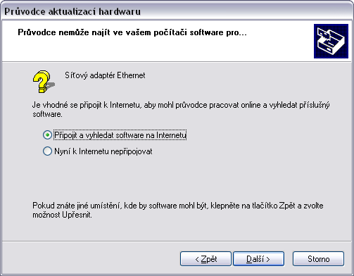

**..coming up as I'm going to properly parse those exported delicious OPML files**

## [Twitter list](https://twitter.com/paveljurca/lists/tech)
## [Windows](windows.md)
## [Perl](perl.md)
## [Linux](linux.md)
## [Web](web.md)
## [Other](other.md)

#### @ NOTES

> The smartest computer in the room is always in someone's head.
> Oblong

Real Programmers Don't Use PASCAL
<http://www.ee.ryerson.ca/~elf/hack/realmen.html>

More About Real Programmers
<http://web.archive.org/web/20080419225755/http://www.suslik.org/Humour/Computer/Langs/real_prog2.html>

The Story of Mel, a Real Programmer
<http://www.cs.utah.edu/~elb/folklore/mel.html>

basics
<http://introcomputing.org/> and so on
<http://en.tldp.org/HOWTO/Unix-and-Internet-Fundamentals-HOWTO/>

or awesome "First Steps in Programming RISC OS Computers"
<http://packages.riscosopen.org/RISC-OS_Pico.zip>

Bret Victor
<http://worrydream.com/LearnableProgramming/>

<http://phoenix.inf.upol.cz/esf/materialy.htm>

alright, so what language then? it does NOT matter
<http://venturebeat.com/2014/06/24/how-to-know-if-youre-learning-the-right-programming-language/>

altogether with free pdfs
<http://www.root.cz/knihy/>

intro to programming
<http://www.udacity.com/course/cs046>

Java, which made OOP concept well known
<http://docs.oracle.com/javase/tutorial/java/concepts/index.html>

<http://www.khanacademy.org/computing/cs>

in these days the best what one could do to understand what's
happening inside a computer is probably going with:

<http://arduino.cc/en/Main/ArduinoStarterKit>

you may go with this materials
<http://sites.google.com/a/umn.edu/me2011/arduino>

<http://www.raspberrypi.org/learning/python-for-vb-programmers/>

from my point of view it's more convinient than reading
what FSB(FrontSideBus) is or what CPU(CentralProcessorUnit)
cache actually does <http://www.akkadia.org/drepper/cpumemory.pdf>

coding standards
<http://www.gnu.org/prep/standards/standards.html#Change-Logs>

12 programming mistakes
<http://www.computerworld.com/s/article/9199798/12_programming_mistakes_to_avoid>

there's always something new to learn
<http://docs.oracle.com/javase/tutorial/essential/concurrency/procthread.html>

BradFrost <http://vimeo.com/63437853>

Greg Wilson <http://vimeo.com/9270320>

> To know something about everything
> and everything about something [..]
> Larry Wall, <http://youtu.be/G49RUPv5-NU>

> Don't just believe that because something is trendy - that it's good.
> Donald Knuth, <http://youtu.be/75Ju0eM5T2c>

.

> If you aren't taking notes, you aren't learning.
> Mark Zuckerberg

.

You can come up with your own ideas.

> The wonderful thing about standards is
> that there are so many of them to choose from.
> Grace Murray Hopper

What the Internet is Doing to Our Brains <http://youtu.be/cKaWJ72x1rI>

* codeconv
* the software exam
* philosophers-as-programmers
* [species of code](http://imagizer.imageshack.us/a/img440/2996/tu2.png)
* staredad

the history
<http://adam.shand.net/library/in_the_beginning_was_the_command_line/>

so on..

ask stupid questions, you'll learn a lot
<http://codereview.stackexchange.com/questions/33914/get-rid-of-getters-and-setters-really>

and see what others are asking
<http://stackoverflow.com/questions/tagged/perl?sort=newest>

Dennis Ritchie did C, and Perl or Python are written in it
<http://www.chiark.greenend.org.uk/~sgtatham/cdescent/>

<http://www-ee.eng.hawaii.edu/Courses/EE150/Book/>

or a few tips on releasing
<http://en.tldp.org/HOWTO/Software-Release-Practice-HOWTO/index.html>

and a license
<http://blog.docracy.com/post/51823372485/software-licensing-what-type-of-license-should-i-use>

the cuckoos egg book

<http://heather.cs.ucdavis.edu/~matloff/Networks/Intro/NetIntro.pdf>

<http://static-course-assets.s3.amazonaws.com/IntroNet50ENU/index.html>

<http://phoenix.inf.upol.cz/esf/ucebni/poc_site.pdf>

The
UNIX-
HATERS
Handbook
<http://web.mit.edu/~simsong/www/ugh.pdf>

<http://online.stanford.edu/course/intro-computer-networking-winter-2014>
    
Internet Users' Glossary
<http://tools.ietf.org/html/rfc1392>

* <http://activedoc.opensuse.org/book/opensuse-start-up>
* <http://linuxcommand.org/lc3_resources.php>
* <http://www.faqs.org/docs/artu/index.html>
* <http://doc.opensuse.org/products/draft/SLES/SLES-admin_sd_draft/index.html>
* <http://www.tldp.org/LDP/nag/node1.html>
* <http://www.linfo.org/>

<http://motherfuckingwebsite.com/>

* OWASP
<http://sourceforge.net/projects/owasp/files/Guide/2.0.1/OWASPGuide2.0.1.pdf/download>

* RFC, HTTP
<https://tools.ietf.org/html/rfc2616>

*** 

GIT 

introduction
<http://vimeo.com/35778382>

github guides
<http://guides.github.com/>

cheatsheet
<http://education.github.com/git-cheat-sheet-education.pdf>

databases
<http://class.stanford.edu/courses/DB/2014/SelfPaced/about>

UX

**Computers just tell you what is wrong but not what to do about it.**

***

__privacy__

* <http://tech.ihned.cz/geekosfera/c1-61604170-informacni-bezpecnost-sifrovani-navod-bezpecnost>
* <http://www.cse.wustl.edu/~jain/cis788-97/ftp/virtual_lans/>
* <http://community.openvpn.net/openvpn/wiki/293-what-is-the-principle-behind-openvpn-tunnels>
* <http://sockslist.net/>
* <http://tails.boum.org/doc/about/warning/index.en.html>
* <http://www.overclock.net/t/1364911/accessing-the-internet-without-and-isp>
* <http://crypto.stackexchange.com/questions/6585/gpg-vs-pgp-vs-openssh-and-management-of-them>
* <http://www.gnupg.org/>
* <http://futureboy.us/pgp.html>
* <http://github.com/ohEmily/RSA-Encryptor>

* ghostery
* noscript
* https everywhere
* adblock plus

***

